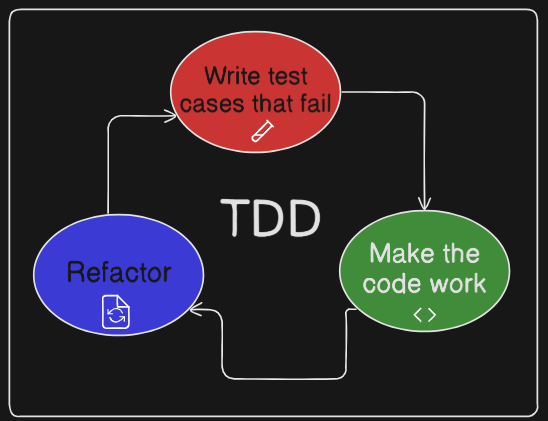
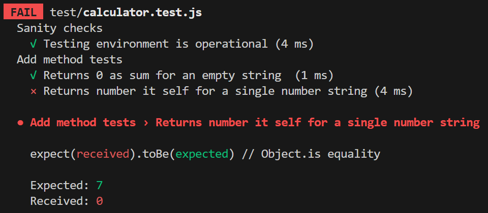
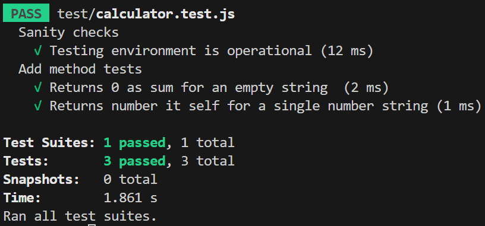

# Calculator TDD Assessment Project

## InfoByte Software Craft Engineer Recruitment

This project demonstrates Test-Driven Development (TDD) principles by implementing a string calculator with comprehensive test coverage using JavaScript and Jest.

## What is Test-Driven Development (TDD)?

Test-Driven Development is a software development approach where tests are written before the actual code. It follows a simple cycle:

<p align="center">
  
</p>

---

### The TDD Cycle:
1. **Red** - Write a failing test
2. **Green** - Write the minimum code to make the test pass
3. **Refactor** - Improve the code while keeping tests green

### Benefits of TDD:
- Ensures code quality and reliability
- Provides immediate feedback on code changes
- Creates comprehensive test documentation
- Reduces debugging time
- Encourages better software design

---

## Project Overview

**Objective**: Create a string calculator that can add numbers from a string input using TDD methodology.

**Technology Stack**:
- JavaScript (ES6+)
- Jest (Testing Framework)

## Test Cases

The calculator implementation follows these test cases:

| Test Case | Input | Expected Output | Description |
|-----------|-------|----------------|-------------|
| Empty String | `add('')` | `0` | Returns 0 as sum for an empty string |
| Single Number | `add('7')` | `7` | Returns number itself for a single number string |
| Comma Separated | `add('1,2,3')` | `6` | Returns addition of comma-separated numbers in string |
| Newline Delimiter | `add("1\n2,3")` | `6` | Returns addition of numbers separated by new line |
| Custom Delimiter | `add("//;\n1;2")` | `3` | Returns addition of numbers using custom delimiter |
| Negative Numbers | `add('1,-2,-3,4,-5')` | `Throws NegativeNumberNotAllowedError` | Throws error listing all negative numbers |
| Ignore Large Numbers | `add("//;\n1000;1001;3")` | `1003` | Ignores numbers greater than 1000 while using custom delimiter |
| Long Delimiters | `add("//[***]\n1***1001***3")` | `4` | Supports delimiters of any length and ignores numbers > 1000 |
| Multiple Delimiters | `add("//[***][%%]\n1***2%%3")` | `6` | Supports multiple delimiters of any length |
| Call Counter | `GetCalledCount()` after 3 calls | `3` | Tracks how many times add() was called |

## Project Structure

```
tdd-calculator/
├── src/
│   └── calculator.js
│   └── error.js
├── tests/
│   └── calculator.test.js
├── images/
│   ├── tdd.png
│   ├── fail.png
│   └── pass.png
├── package.json
└── README.md
```

## Installation & Setup

1. **Clone the repository**
   ```bash
   git clone https://github.com/kevalmadariya/Calculator-TDD-Assessment
   cd tdd-calculator
   ```

2. **Install dependencies**
   ```bash
   npm install
   ```

3. **Run tests**
   ```bash
   npm test
   ```


---

## TDD Implementation Process

### Phase 1: Red (Failing Tests)
Write failing tests first to define the expected behavior:

<p align="center">
  
</p>

### Phase 2: Green (Passing Tests)
Implement minimum code to make tests pass:

<p align="center">
  
</p>

### Phase 3: Refactor
Improve code quality while maintaining green tests.

## Key Features Implemented

✅ **Basic Addition**: Handle empty strings and single numbers  
✅ **Multiple Delimiters**: Support comma and newline separators  
✅ **Custom Delimiters**: Allow user-defined delimiters  
✅ **Error Handling**: Throw exceptions for negative numbers  
✅ **Number Filtering**: Ignore numbers greater than 1000  
✅ **Advanced Delimiters**: Support multi-character delimiters  
✅ **Multiple Custom Delimiters**: Handle multiple delimiter types  
✅ **Call Tracking**: Count function invocations  

## Running Tests

Execute the test suite to verify all functionality:

```bash
# Run all tests
npm test

# Run tests in watch mode
npm run test:watch

# Generate coverage report
npm run test:coverage
```

## Learning Resources

- **Article**: [An Introduction to Test-Driven Development](https://www.freecodecamp.org/news/an-introduction-to-test-driven-development-c4de6dce5c/)
- **Video**: [The Three Laws of TDD (Featuring Kotlin) by Uncle Bob](https://www.youtube.com/watch?v=qkblc5WRn-U)

## Author

**Candidate**: Kanji Madariya  


## License

This project is created for educational and assessment purposes.

---

